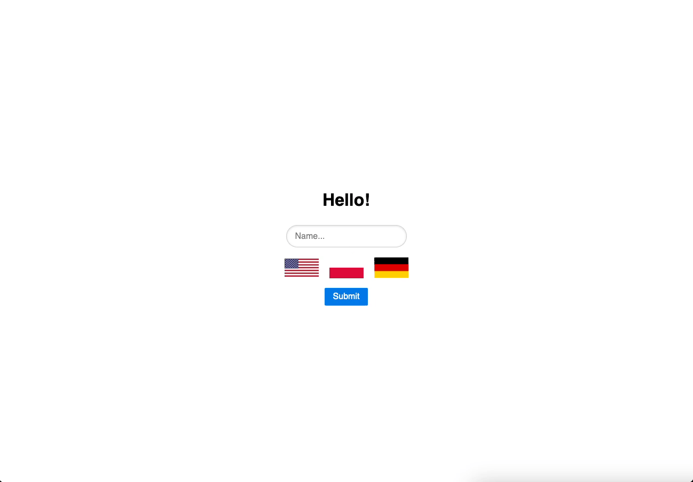

# todo

There is also Jetty version of this application available at [main branch](https://github.com/wkktoria/todo).

## About

Simple to-do list application.

### Demo



## Run the application

> [!CAUTION]
> Running application requires to create `.env` file, see [.env_example](.env_example).

Run the following command in terminal window in the root directory:

```console
./mvnw spring-boot:run
```
